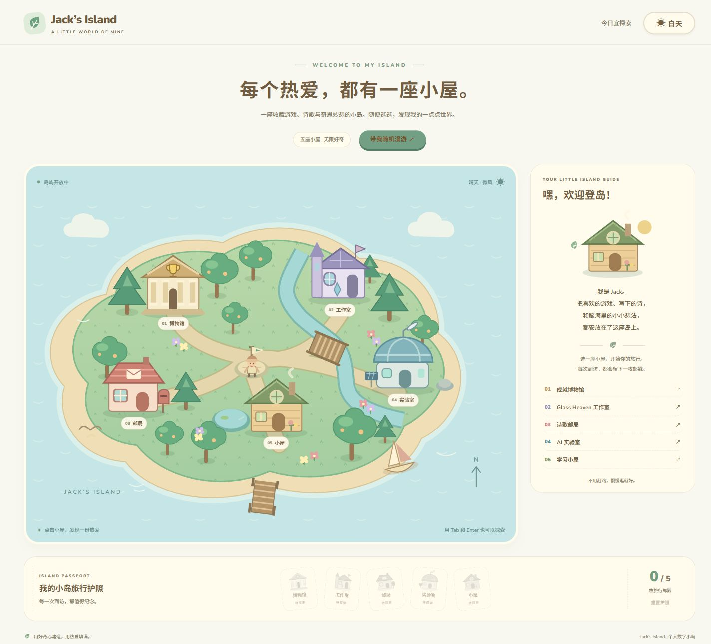
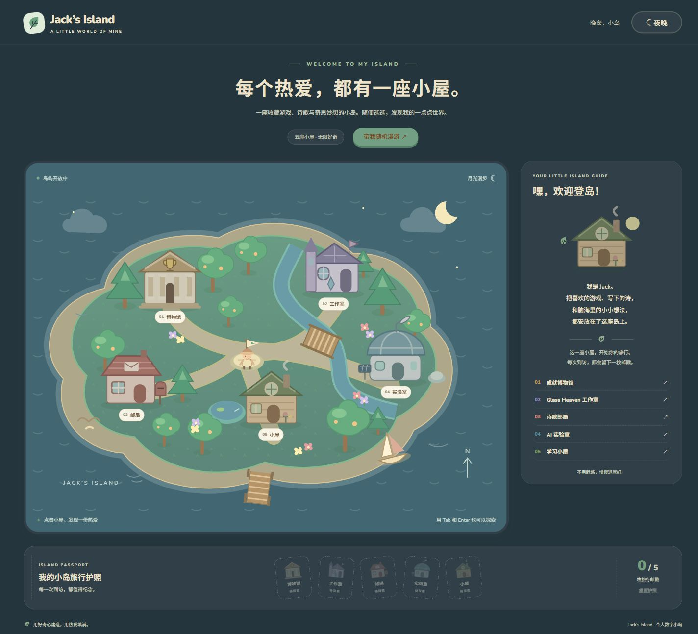
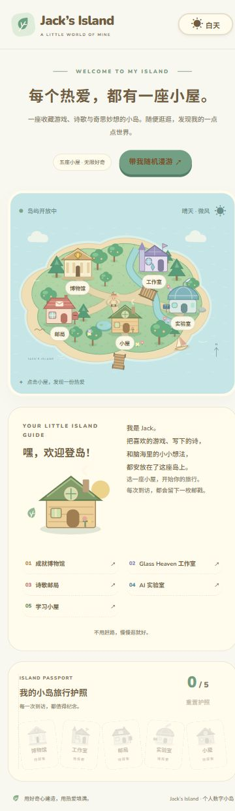

# Jack's Island · 交互式个人数字小岛

每个热爱，都有一座小屋。这是一座可以探索的个人主页小岛：收藏游戏成就，存放诗歌，展示设计项目、技术实验与学习计划。

**[在线体验](https://yansuan0713.github.io/jack-island/)** · [GitHub 仓库](https://github.com/yansuan0713/jack-island) · [第三方许可](THIRD_PARTY_NOTICES.md)

站点已通过 GitHub Actions 发布。后续推送 main 会自动构建、测试并更新。



<details>
<summary>查看夜间与手机预览</summary>





</details>

## 探索小岛

- **成就博物馆**：赛博朋克 2077、只狼、漫威蜘蛛侠 2 的全成就收藏与记录。
- **Glass Heaven 工作室**：个人同人 DLC 项目与 BLUE、AURELIA、OPEN SKY、ASHES 路线档案。
- **诗歌邮局**：《江城归渡》《秋夜江城》的作品信封与翻页展示。
- **AI 实验室**：Jack Model Arena、Jack Game Lab、多 Agent 实验与 AI 工具研究档案。
- **学习小屋**：Python → 数据结构 → Git/GitHub → 项目实践 → Unity/C#。

首次到访建筑收集旅行邮戳，集齐五枚触发庆祝。支持建筑高亮、小角色目的地移动、随机漫游、昼夜切换、返回地图与护照重置。探索进度和主题保存在浏览器 localStorage；无法使用存储时仍能探索。

地图与建筑使用原创 SVG，包含海洋、沙滩、草地、树林、花朵、小路、河流、桥、池塘、码头和帆船。电脑使用地图／侧栏布局，手机使用单栏。按钮支持键盘 Enter，面板支持 Escape 返回；尊重 prefers-reduced-motion。

## 技术栈

React 18、TypeScript、Vite 7、Animal Island UI 2.1.1、原生 SVG/CSS、Node.js 内置测试。无后端、无付费 API、不连接 Notion 或账户，不使用分析追踪。

## 本地启动

需要 Node.js 24 和 npm。

```sh
npm install
npm run dev -- --port 5173 --strictPort
```

访问 http://127.0.0.1:5173/ 。

```sh
npm test
npm run build
node scripts/verify-dist.mjs
npm run preview -- --port 4173 --strictPort
```

生产预览地址：http://127.0.0.1:4173/jack-island/ 。生产 base 固定为 `/jack-island/`，开发服务器仍在 `/`；若仓库改名或启用自定义域名，应同步调整 vite.config.ts 的 base。

## GitHub Pages 自动部署

.github/workflows/pages.yml 在推送 main 或手动触发时运行：

1. Node.js 24 执行 npm ci。
2. 运行现有状态回归测试。
3. TypeScript 检查并构建。
4. 验证 HTML、CSS 字体／图片的子路径和许可证产物。
5. 只上传 dist，用官方 Pages Actions 部署。

仓库 Settings → Pages → Source 使用 **GitHub Actions**。无需个人访问令牌：构建只读源码，部署使用 pages: write 和 id-token: write；官方 Actions 固定到提交 SHA。

首次发布先确认仓库可见性和公开范围，不覆盖已有仓库。后续提交并推送 main 即自动更新站点。站点为单页面，无需额外 SPA 路由回退规则。

## 项目结构

```text
.github/workflows/pages.yml  GitHub Pages 构建和部署
src/
  App.tsx                   探索状态、主题、庆祝与焦点
  data.ts                   建筑和内容资料
  state.mjs                 保存、校验、去重与容错
  styles.css                场景配色、动画与响应式
  components/
    Art.tsx                 原创 SVG 场景与建筑
    IslandMap.tsx           地图按钮、小角色
    ContentPanel.tsx        五类建筑内容
    Passport.tsx            邮戳护照
public/licenses/            完整第三方许可，复制到 dist
docs/images/                已审查的项目截图
scripts/verify-dist.mjs     Pages 子路径与产物检查
tests/state.test.mjs        状态回归测试
```

.gitignore 排除 node_modules、dist、工作草稿、交付报告、环境文件、私钥、缓存、日志和测试产物。测试源码保留并由 CI 执行；公开截图仅保留网页画面。

## 设计来源与许可

真实复用 [Animal Island UI](https://github.com/guokaigdg/animal-island-ui) 的 Button、Card、Progress 和 animal-island-ui/style，沿用暖棕文字、薄荷色、奶油纸面、圆角与胶囊按钮。参考源快照：b20e6bf8b712282bd7b01933cba584ebd322b6eb；发布依赖固定 2.1.1，版本由 package-lock.json 锁定。

该库不是地图引擎，地图、建筑、角色与 favicon 为本项目原创。未使用任天堂／游戏官方截图、美术、标志或音频；项目与相关厂商无关联。

Animal Island UI、naive-icons、React、ReactDOM、Scheduler 和 classnames 为 MIT；Nunito 与 Noto Sans SC 为 SIL Open Font License 1.1。完整版权与许可正文在 public/licenses，生产构建保留到 dist/licenses。详见 [THIRD_PARTY_NOTICES.md](THIRD_PARTY_NOTICES.md)。第三方许可不表示对原创诗词／同人作品另行授予使用许可。

## 内容与兼容性边界

游戏成就使用岛主提供的事实；蜘蛛侠 2 未提供总数量。Glass Heaven 仅展示确认的四个路线名称。诗歌未获得全文，信纸明确标注待补充，不冒充原作。AI 实验外链／结果与学习完成进度也等待资料，不编造。

角色移动为目的地动画，未实现碰撞或寻路。无 Notion API、后台或账户。localStorage 按域名隔离，本地进度不自动迁移到正式站点；内嵌框架或隐私模式可能限制保存，页面会提示。

## Notion 首页入口

建议标题：**Jack's Island · 去我的小岛坐坐**。

建议描述：**探索我的游戏收藏、诗歌、Glass Heaven 工作室与 AI 实验，顺手收集五枚旅行邮戳。**

使用地图截图作为封面预览，并在正文放正式链接；封面是静态图片。也可输入 /embed 后粘贴正式 HTTPS 地址。尺寸与兼容性建议见 [Notion 集成指南](docs/notion-integration.md)。
